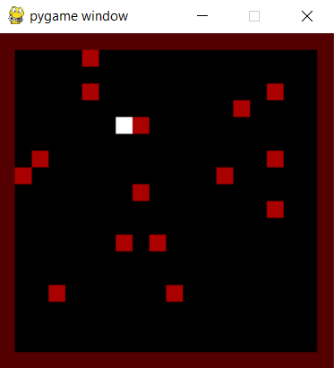

# Open Worlds [WIP]

Open Worlds is a MMO grid world game where players deploy agents to survive in an online world.



## TL;DR: How it works
1. The server runs constantly with an internal clock.
2. At each tick, it attempts to call players' provided cURL where they deployed their agents.
3. Each cURL provides the agent's observation, and expects an action response.
4. The server then executes the collected actions in the online world.

#### Why?
* Existing script-based games (in particular: screeps.com) host players' scripts on their own game servers, limiting the amount of compute available and restricting the usage of AI agents.
  By allowing players to script directly from their local server, agent compute is distributed to players, allowing deployment of AI agents.
* Existing AI-based MMO (in particular: Neural MMO) is focused on research, so they do not host a dedicated online game server.

## Game Mechanics
* The world is 10x10, where outermost rows and columns are wall borders.
* 20 fruits are randomly dropped on the map, each giving +1 score to the agent that lands on it.
* Players' actions are: move left, right, up or down.

## Quickstart
```
git clone https://github.com/jetnew/open-worlds.git
pip install requirements.txt
uvicorn game.server:app --reload --port 50500
python agent/client.py
python display/server.py
```

## Upcoming Plans
In order of priority:
1. Create fast game display.
2. Add more game mechanics.
3. Simplify player agent creation.