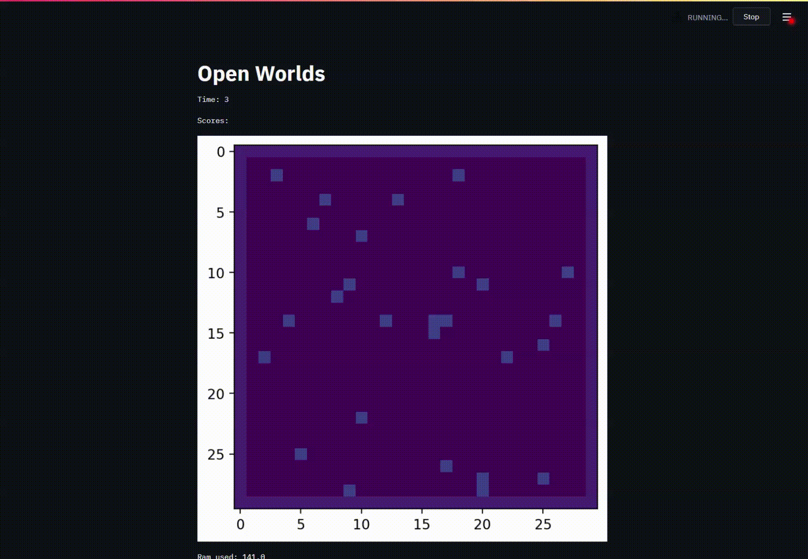

# Open Worlds

Open Worlds is a MMO grid world game where players deploy agents to survive in an online world.

* Wiki: [Open Worlds Wiki](https://github.com/jetnew/open-worlds/wiki)
* Game: [github.com/jetnew/open-worlds](github.com/jetnew/open-worlds)
* Interface Server: [github.com/jetnew/open-worlds-interface](github.com/jetnew/open-worlds-interface)
* Agent Server: [github.com/jetnew/open-worlds-agents](github.com/jetnew/open-worlds-agents)

**Play now**: [Open Worlds](https://share.streamlit.io/jetnew/open-worlds-interface)

## Why?

A game where players deploy [bots](https://en.wikipedia.org/wiki/Internet_bot) to play a game is not new (e.g. [screeps.com](https://screeps.com)), but because existing games host player-written scripts for the players, it is not scalable to the usage of [artificial intelligence](https://en.wikipedia.org/wiki/Deep_learning) techniques. By allowing players to host their own scripts, gameplay can scale to complex emergent agent behaviors.

For more information, please refer to the [Open Worlds Wiki](https://github.com/jetnew/open-worlds/wiki).